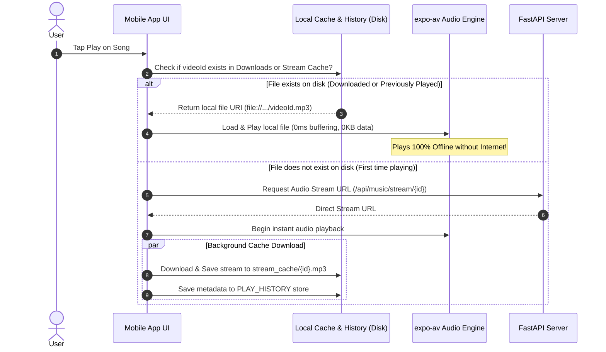
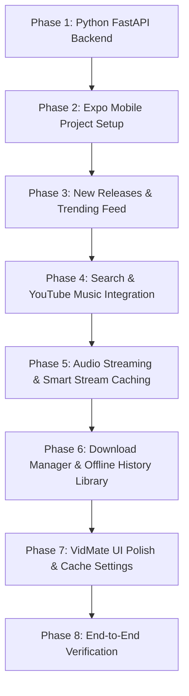

# VidMate-Style Mobile Music Downloader & Player App - Implementation Plan

## Goal Description
Build a full-featured VidMate-style mobile music application that allows users to:
1. **Discover New Releases**: Browse newly released music, trending tracks, and charts sourced from YouTube / YouTube Music.
2. **Search Music**: Query YouTube for any song, artist, album, or playlist with instant rich metadata (title, artist, duration, cover art).
3. **Listen to Music (In-App Player)**: Stream audio seamlessly with a persistent bottom mini-player and an expandable full-screen player (album artwork, seek bar, play/pause, queue, shuffle/repeat, background playback).
4. **Download Music**: Download songs directly to mobile storage in high-quality audio (MP3/M4A) with embedded tags and thumbnail art.
5. **Offline Library**: Play downloaded music without an internet connection, manage storage, and organize playlists.
6. **Smart Stream Caching & Offline History (Requested Feature)**: Any music played or listened to in the app (even without clicking download) is automatically cached in the background and stored in playback history. **All played/history music can be replayed again completely offline without internet!**

```
+----------------------------------------------------------------------------------------------------+
|                                  Mobile App (React Native / Expo)                                  |
|                                                                                                    |
|  +-------------------+  +-------------------+  +------------------------------------------------+  |
|  |   Discover Screen |  |   Search Screen   |  |        Downloads & History Library             |  |
|  | - New Releases    |  | - Live YouTube    |  | - Downloaded MP3s (Permanent Storage)         |  |
|  | - Trending Charts |  |   Music Query     |  | - Played / History Cache (100% Offline Playable)|  |
|  | - Genre Feeds     |  | - Quick Download  |  | - Active Downloads Progress                    |  |
|  +-------------------+  +-------------------+  +------------------------------------------------+  |
|                                                                                                    |
|  +-----------------------------------------------------------------------------+  |
|  |                       Smart Audio Engine & Cache Resolver                                    |  |
|  |   1. Check Local Downloads -> 2. Check Stream Cache (History) -> 3. Stream & Auto-Cache      |  |
|  |   - Bottom Mini-Player  |  Full-Screen Player Modal  |  Background Audio                     |  |
|  +-----------------------------------------------------------------------------+  |
+---------------------------------------------------+------------------------------------------------+
                                                    | REST API (HTTP)
                                                    v
+----------------------------------------------------------------------------------------------------+
|                                    Backend Microservice (FastAPI)                                  |
|                                                                                                    |
|  +---------------------------+  +----------------------------------+  +-------------------------+  |
|  |        ytmusicapi         |  |             yt-dlp               |  | Audio Stream & Download  |  |
|  | - New Releases & Charts   |  | - Direct Progressive Audio Stream|  | - MP3/M4A Transcoding   |  |
|  | - YouTube Music Search    |  | - Metadata & Thumbnails Extractor|  | - Fast Chunk Streaming  |  |
|  +---------------------------+  +----------------------------------+  +-------------------------+  |
+----------------------------------------------------------------------------------------------------+
```

---

## User Review Required

> [!IMPORTANT]
> **Yes, Offline Playback of Streamed Music (History) is 100% Feasible!**
> Modern streaming apps (Spotify, YouTube Music, SoundCloud) use **transparent stream caching**.
> When a user plays any song:
> 1. The mobile app automatically downloads the audio into a local cache directory (`FileSystem.cacheDirectory + 'stream_cache/{videoId}.mp3'`).
> 2. The song's full metadata (title, artist, artwork URL, duration, timestamp) is added to `AsyncStorage` under `PLAY_HISTORY`.
> 3. Whenever that song is played again—whether tapped in History, Search, or Playlists—the player detects the local cached file and plays directly from disk (`file://...`).
> 4. **No internet connection is needed for subsequent plays!**

> [!TIP]
> **Cache Management & Promotion**
> - **Zero-Data Promotion**: If a user is listening to a cached history song and decides to keep it permanently, clicking "Download" will instantly promote the already-cached file into the permanent Downloads folder in under a second without re-downloading from the internet.
> - **Smart LRU Pruning**: Users can configure cache limit in Settings (e.g. 1GB / 2GB / 5GB / Unlimited). If storage reaches the limit, the least recently played cached songs are pruned automatically, while permanently downloaded tracks are never touched.

---

## Proposed Architecture & Design

### 1. Technology Stack
| Layer | Technology | Rationale |
|---|---|---|
| **Mobile Frontend** | React Native (Expo SDK 52+ / TypeScript) | Cross-platform (Android & iOS), live testable via Expo Go on physical device or web preview, hot reload. |
| **Audio Engine** | `expo-av` | Robust audio streaming, local file playback, seek, playback state management, background audio. |
| **Download & Caching**| `expo-file-system` + `@react-native-async-storage/async-storage` | Saves both permanent downloads and stream caches directly to device storage; persists song metadata & playback history. |
| **Backend Service** | Python FastAPI + Uvicorn | High performance asynchronous API; installed & ready on Python 3.12. |
| **Music Data Engine** | `ytmusicapi` | Scrapes YouTube Music official charts, new releases, search results, artist details, and album covers. |
| **Audio Stream & Extraction** | `yt-dlp` | Extracts progressive audio stream URLs, converts audio, formats metadata tags. |

---

## Smart Stream Caching & Offline History Flow



---

## Proposed Changes

```
music_downloader/
├── backend/
│   ├── app/
│   │   ├── __init__.py
│   │   ├── main.py              # FastAPI app entry point & CORS configuration
│   │   ├── routers/
│   │   │   ├── __init__.py
│   │   │   ├── music.py         # Search, New Releases, Trending, Track Info
│   │   │   └── download.py      # Audio streaming & direct file download endpoints
│   │   ├── services/
│   │   │   ├── __init__.py
│   │   │   ├── youtube_service.py # ytmusicapi & yt-dlp wrapper functions
│   │   │   └── cache_service.py   # In-memory LRU cache for search & releases
│   │   └── models/
│   │       ├── __init__.py
│   │       └── music_schemas.py # Pydantic models (Track, Album, SearchResult)
│   ├── requirements.txt         # fastapi, uvicorn, yt-dlp, ytmusicapi
│   └── run_server.py            # Local backend launcher script
│
├── mobile/
│   ├── App.tsx                  # App entry with Providers & Tab Navigator
│   ├── package.json
│   ├── tsconfig.json
│   ├── app.json                 # Expo configuration (permissions, app name, icon)
│   ├── src/
│   │   ├── api/
│   │   │   └── musicApi.ts      # Axios/Fetch client connecting to FastAPI backend
│   │   ├── context/
│   │   │   ├── AudioContext.tsx # Global audio player state & smart offline-first resolver
│   │   │   ├── DownloadContext.tsx # Download manager state (active downloads, completed tracks)
│   │   │   └── HistoryContext.tsx  # Playback history & stream cache manager
│   │   ├── screens/
│   │   │   ├── HomeScreen.tsx   # New Releases banner, trending lists, quick play
│   │   │   ├── SearchScreen.tsx # Search bar, suggestions, song results with download button
│   │   │   ├── LibraryScreen.tsx# Offline hub: Downloads, History (Played Offline), Playlists
│   │   │   └── SettingsScreen.tsx# Cache size limit, Clear Cache, Download quality
│   │   ├── components/
│   │   │   ├── MiniPlayer.tsx   # Persistent bottom playback bar
│   │   │   ├── PlayerModal.tsx  # Full-screen expandable player with rotating artwork & controls
│   │   │   ├── TrackCard.tsx    # Reusable track item with offline status badge (⚡ Cached / 📥 Downloaded)
│   │   │   ├── DownloadButton.tsx # One-click download with progress spinner
│   │   │   └── SectionHeader.tsx # Header for New Releases, Trending, History, etc.
│   │   ├── services/
│   │   │   └── cacheManager.ts  # Automatic stream caching, cache size calculation & LRU pruning
│   │   ├── types/
│   │   │   └── index.ts         # TypeScript interfaces (Track, DownloadItem, HistoryItem, PlayerState)
│   │   └── utils/
│   │       ├── storage.ts       # AsyncStorage helpers for offline songs, history & favorites
│   │       └── formatters.ts    # Duration (mm:ss), file size, and view count formatters
│   └── assets/                  # Icons, splash screen, placeholders
├── music_app_implementation_plan.md # Root copy of this plan
└── README.md                    # Setup and execution instructions
```

---

## Detailed Component Specifications

### 1. Backend Service (FastAPI)

#### Endpoints
- `GET /api/music/new-releases`:
  - Returns newly released albums, singles, and hot tracks using `ytmusic.get_new_releases()`.
  - Cached for 1 hour to ensure rapid client loading.
- `GET /api/music/trending`:
  - Returns current music charts and trending music videos using `ytmusic.get_charts()`.
- `GET /api/music/search?q={query}&filter={songs|videos|albums}`:
  - Searches YouTube Music with structured metadata (videoId, title, artists, duration, high-res thumbnail).
- `GET /api/music/stream/{videoId}`:
  - Extracts the direct audio stream URL (`yt-dlp -g -f bestaudio`) with headers for client streaming.
- `GET /api/music/download/{videoId}`:
  - Streams the audio file with `Content-Disposition: attachment; filename="{title}.mp3"` for mobile downloading.
- `GET /api/music/info/{videoId}`:
  - Fetches track details, lyrics, and related suggested songs.

---

### 2. Mobile Frontend (React Native Expo)

#### Visual Theme (VidMate Aesthetic)
- **Palette**: Dark modern UI (slate/obsidian `#121214`, accent vibrant red/orange `#FF334B` or `#E50914`, surface card `#1E1E24`, text `#FFFFFF` and muted text `#9E9EA7`).
- **Layout**: Smooth bottom navigation bar with 4 tabs:
  1. 🏠 **Home (New Music & Discover)**: Featured banner, "New Releases" horizontal carousel, "Top Trending" list.
  2. 🔍 **Search**: Real-time query search, quick download and play buttons.
  3. 📥 **Library (Downloads & History)**:
     - **Tab 1: Downloaded**: Permanently saved tracks.
     - **Tab 2: History (Offline Ready)**: All songs ever played in the app, with offline status badge ⚡, replayable without internet!
     - **Tab 3: Downloading**: Active download progress tasks.
  4. ⚙️ **Settings**: Backend server address, cache size limit slider, "Clear History Cache" button, audio quality selection.

#### Smart Stream Cache & History Engine (`src/services/cacheManager.ts`)
```typescript
import * as FileSystem from 'expo-file-system';
import AsyncStorage from '@react-native-async-storage/async-storage';
import { Track } from '../types';

const CACHE_DIR = `${FileSystem.cacheDirectory}stream_cache/`;
const HISTORY_KEY = '@music_play_history';

// Ensure directory exists
export const initCacheDir = async () => {
  const dirInfo = await FileSystem.getInfoAsync(CACHE_DIR);
  if (!dirInfo.exists) {
    await FileSystem.makeDirectoryAsync(CACHE_DIR, { intermediates: true });
  }
};

// Check if a song is already cached on disk (Download or Stream Cache)
export const getLocalAudioUri = async (videoId: string): Promise<string | null> => {
  // 1. Check permanent downloads
  const downloadUri = `${FileSystem.documentDirectory}music/${videoId}.mp3`;
  const dlInfo = await FileSystem.getInfoAsync(downloadUri);
  if (dlInfo.exists) return downloadUri;

  // 2. Check stream cache
  const cacheUri = `${CACHE_DIR}${videoId}.mp3`;
  const cacheInfo = await FileSystem.getInfoAsync(cacheUri);
  if (cacheInfo.exists) return cacheUri;

  return null;
};

// Cache a stream in the background when user listens to it
export const cacheTrackInBackground = async (track: Track, streamUrl: string) => {
  try {
    await initCacheDir();
    const targetUri = `${CACHE_DIR}${track.id}.mp3`;
    const check = await FileSystem.getInfoAsync(targetUri);
    if (!check.exists) {
      await FileSystem.downloadAsync(streamUrl, targetUri);
    }
    // Save/Update playback history
    await recordPlayHistory(track, targetUri);
  } catch (err) {
    console.warn('Background caching failed:', err);
  }
};
```

#### Persistent Audio Player (`src/context/AudioContext.tsx`)
- Uses `expo-av` Sound API.
- Implements **Offline-First Playback**:
  1. Calls `getLocalAudioUri(track.id)`.
  2. If file found on disk, immediately plays local `file://...` URI.
  3. If not found, requests `/api/music/stream/{id}`, begins playback, and triggers background caching so subsequent plays work without internet.
- Bottom **MiniPlayer**: Visible across all tabs, showing current song title, artist, thumbnail, Play/Pause, and Next.
- Full **Player Modal**: Large cover art with subtle rotating vinyl animation, interactive seek slider, repeat/shuffle buttons, and upcoming queue view.

---

## Step-by-Step Implementation Roadmap



### Phase 1: Backend Setup & API Endpoints
1. Create `backend/` directory and Python virtual environment / dependencies (`fastapi`, `uvicorn`, `yt-dlp`, `ytmusicapi`, `requests`).
2. Implement `youtube_service.py` with `get_new_releases`, `get_charts`, `search_music`, `get_audio_stream_url`, and download stream handler.
3. Implement `main.py` with CORS middleware allowing local mobile app access.
4. Test all endpoints locally with automated tests (`pytest` or test script).

### Phase 2: Mobile App Project Initialization
1. Initialize React Native Expo app in `mobile/` with TypeScript template.
2. Install dependencies:
   - Navigation: `@react-navigation/native`, `@react-navigation/bottom-tabs`, `react-native-screens`, `react-native-safe-area-context`.
   - Audio: `expo-av`.
   - Storage & Files: `expo-file-system`, `@react-native-async-storage/async-storage`.
   - UI & Icons: `@expo/vector-icons`, `react-native-reanimated`, `@react-native-community/slider`.
3. Configure `app.json` permissions for audio background playback and file system storage.

### Phase 3: Home & "New Releases" Screen
1. Implement `HomeScreen.tsx` fetching `/api/music/new-releases` and `/api/music/trending`.
2. Build UI:
   - Header with app brand "VidMusic" / VidMate styling.
   - Hero banner for featured album/single.
   - Horizontal scrolling carousel for "New Releases".
   - Vertical ranking cards for "Trending Music".
3. Add pull-to-refresh to fetch updated releases.

### Phase 4: Search Screen
1. Implement `SearchScreen.tsx` with live debounced search input.
2. Filter tags: All, Songs, Albums, Artists.
3. Search result list with thumbnail, song title, artist, duration.
4. Action buttons on each item: "Play Now" and "Download".

### Phase 5: Audio Player Engine & Smart Stream Caching
1. Implement `cacheManager.ts` to manage audio stream caching and play history.
2. Implement `AudioContext.tsx` with `expo-av` and offline-first disk check.
3. Background caching triggers automatically whenever a song starts playing.
4. Build `MiniPlayer.tsx` pinned above the tab bar.
5. Build `PlayerModal.tsx` expandable full player with cover art, progress slider, and controls.

### Phase 6: Download Manager & Offline History Library
1. Implement `DownloadContext.tsx` with `FileSystem.createDownloadResumable` for explicit downloads.
2. Implement `HistoryContext.tsx` providing all previously played tracks.
3. Build `LibraryScreen.tsx` with:
   - "Downloaded": Permanently saved songs.
   - "History (Offline Ready)": All played songs with cached status badge ⚡, ready to play offline!
   - "Downloading": Active download tasks.
4. Allow one-tap promotion: promote any history song to permanent download instantly without re-downloading.

### Phase 7: UI Polish, Storage & Cache Settings
1. Sleek dark VidMate theme styling across all screens.
2. Settings screen controls:
   - Cache Size Indicator (e.g. "Stream Cache: 145 MB / 1 GB").
   - "Clear Stream Cache" button.
   - Auto-Cache on playback toggle.
   - Configurable backend URL for LAN/WiFi testing.

---

## Verification Plan

### Automated Tests
1. **Backend API Suite**:
   - `python -m pytest backend/tests/test_api.py`
   - Verify `/api/music/new-releases` returns valid list with titles, artist, and thumbnails.
   - Verify `/api/music/search?q=coldplay` returns search results with video IDs.
   - Verify `/api/music/stream/{id}` extracts a playable audio stream URL.
2. **Frontend Type-check & Linting**:
   - `npm run tsc` inside `mobile/` to ensure zero TypeScript errors.

### Manual Verification
1. **Discover & New Releases**:
   - Open app -> verify "New Releases" section populates with the latest music releases from YouTube Music.
2. **Search**:
   - Search for a song -> verify results render quickly with correct metadata.
3. **Play & Smart Stream Cache (Offline Test)**:
   - Play a song while connected to internet.
   - Let the song start playing.
   - Turn OFF Wi-Fi / disconnect internet.
   - Tap the song in "History / Recently Played" -> verify it plays smoothly completely offline!
4. **Download & Library**:
   - Tap "Download" on a track -> verify progress bar and verify track appears in "Downloaded" library.
5. **Cache Management**:
   - Check Settings -> verify cache usage updates accurately and clear cache functions as expected.
